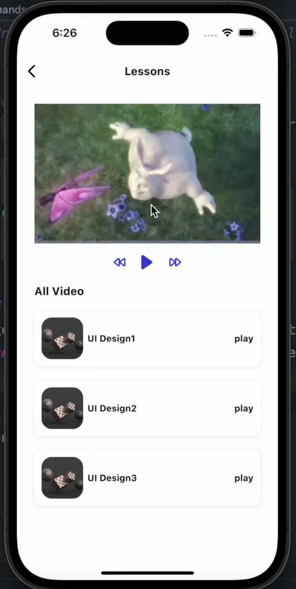
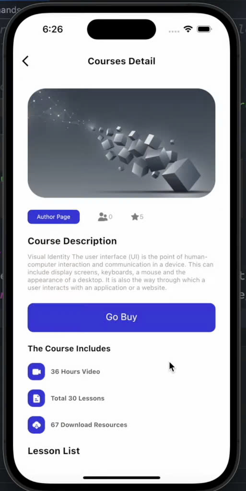
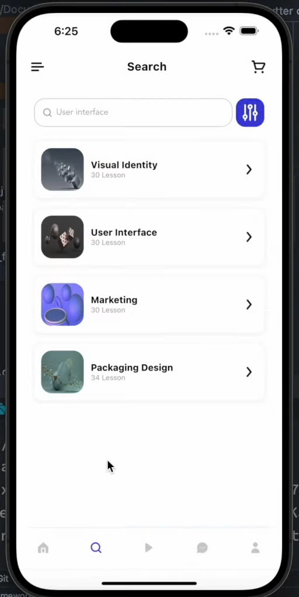
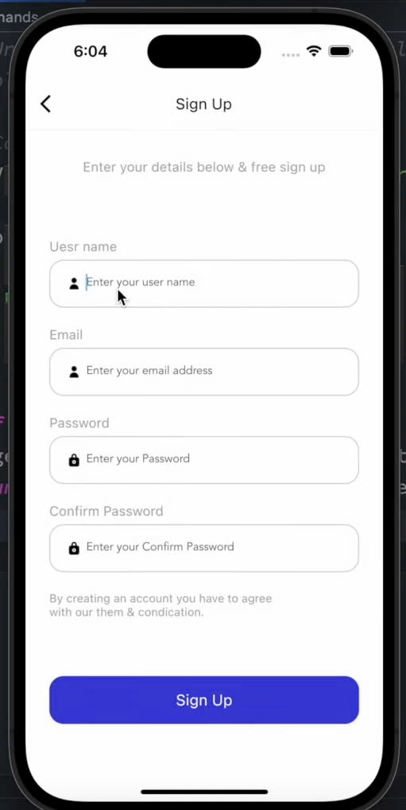
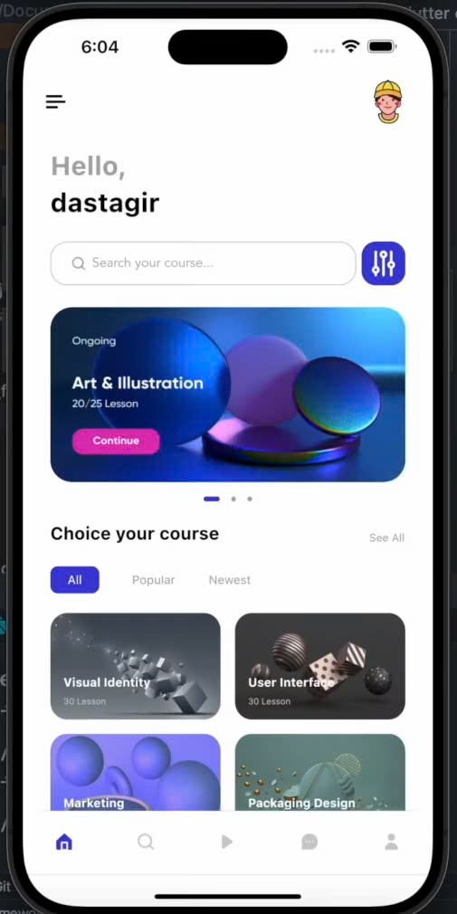
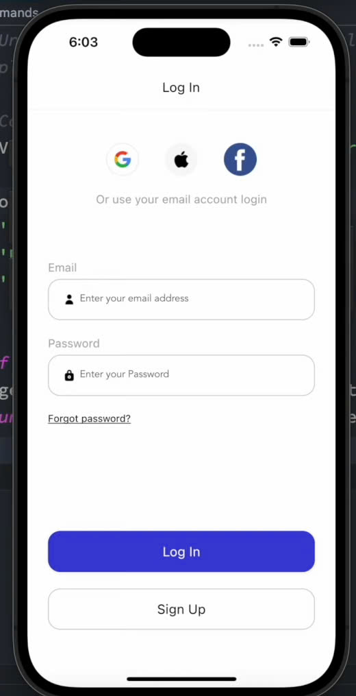
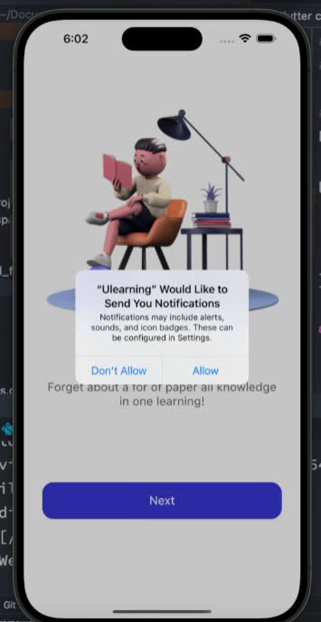

# ULearning App

A modern Flutter-based learning application designed to provide an engaging educational experience for students and teachers.

## 📱 Screenshots

<div align="center">
  
  
  
  
  
  
  
</div>

## 📋 Project Overview

ULearning App is a comprehensive educational platform that provides:
- Interactive learning materials
- Real-time progress tracking
- Personalized learning paths
- Collaborative learning features
- Assessment and feedback system

## 📁 Project Structure

```
ulearning_app/
├── lib/
│   ├── screens/          # UI screens
│   ├── widgets/          # Reusable UI components
│   ├── models/           # Data models
│   ├── services/         # API services
│   ├── utils/            # Utility functions
│   ├── constants/        # App constants
│   └── main.dart         # App entry point
├── assets/
│   ├── images/           # Image assets
│   └── fonts/            # Custom fonts
├── test/                 # Test files
└── screenshots/          # App screenshots
```

## 🚀 Features

### User Management
- User registration and authentication
- Profile management
- Role-based access control (Student/Teacher/Admin)

### Learning Features
- Course browsing and enrollment
- Interactive lessons
- Progress tracking
- Quiz and assessment system
- Discussion forums
- File sharing and resources

### Administrative Features
- Course management
- User management
- Analytics and reporting
- Content moderation

## 🛠️ Technology Stack

### Frontend
- **Flutter**: UI framework
- **Dart**: Programming language
- **Provider**: State management
- **GetX**: Navigation and dependency injection
- **Shared Preferences**: Local storage
- **Cached Network Image**: Image caching
- **Flutter Secure Storage**: Secure data storage


## 🔌 RESTful API Endpoints

### Authentication
```
POST /api/auth/register     # Register new user
POST /api/auth/login        # User login
POST /api/auth/refresh      # Refresh token
```

### User Management
```
GET    /api/users           # Get all users
GET    /api/users/:id       # Get user by ID
PUT    /api/users/:id       # Update user
DELETE /api/users/:id       # Delete user
```

### Course Management
```
GET    /api/courses         # Get all courses
POST   /api/courses         # Create course
GET    /api/courses/:id     # Get course details
PUT    /api/courses/:id     # Update course
DELETE /api/courses/:id     # Delete course
```

### Content Management
```
GET    /api/lessons         # Get all lessons
POST   /api/lessons         # Create lesson
GET    /api/lessons/:id     # Get lesson details
PUT    /api/lessons/:id     # Update lesson
DELETE /api/lessons/:id     # Delete lesson
```

### Assessment
```
GET    /api/quizzes         # Get all quizzes
POST   /api/quizzes         # Create quiz
GET    /api/quizzes/:id     # Get quiz details
POST   /api/quizzes/:id/submit  # Submit quiz
```

## 📋 Prerequisites

- Flutter SDK (>=2.0.0)
- Dart SDK (>=2.12.0)
- Android Studio / VS Code
- Android SDK / Xcode (for iOS development)
- Node.js (for backend development)
- MongoDB
- Redis

## 🔧 Installation

1. Clone the repository
```bash
git clone https://github.com/yourusername/ulearning_app.git
```

2. Navigate to the project directory
```bash
cd ulearning_app
```

3. Install dependencies
```bash
flutter pub get
```

4. Set up environment variables
```bash
cp .env.example .env
```

5. Run the app
```bash
flutter run
```

## 📚 Resources

- [Flutter Documentation](https://docs.flutter.dev/)
- [Flutter Cookbook](https://docs.flutter.dev/cookbook)
- [Dart Documentation](https://dart.dev/guides)

## 📝 License

This project is licensed under the MIT License - see the [LICENSE](LICENSE) file for details.

## 🤝 Contributing

Contributions are welcome! Please feel free to submit a Pull Request.

## 📫 Contact

Your Name - [@yourtwitter](https://twitter.com/yourtwitter)

Project Link: [https://github.com/yourusername/ulearning_app](https://github.com/yourusername/ulearning_app)
